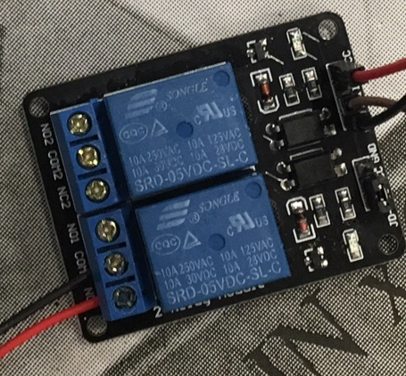

Intercom Alsace-Lorraine
---
# Principe

On se place en attente active sur un signal d'ouverture au niveau du bornier (CT).

Sur réception, on appelle une API qui donne ou non son accord pour l'ouverture.

L'ouverture se fait à l'aide d'un relai, qui simule l'appui sur le bouton d'ouverture de la porte.

# Détection du signal d'ouveture

Quand une personne sonne en bas, un signal continu d'environ 15-18 V monte. Un simple pont diviseur de tension a été mis en place pour rabaisser le niveau à 3.3 V.

# Ouverture de la porte

Un simple relai 5V réalise cette opération. Quand il s'active, il réalise un contact au nivau de 2 fils soudés à chaque extrémité du bouton poussoir.

Le cablage est le suivant:
- GND sur un des pins GND du RPi (ici, pin 6 sur le header).
- VCC sur un des pins 5V du RPi (ici, pin 2 sur le header).
Du côté du bouton poussoir, peu importe, un des fils sur COM1, et l'autre sur NC1.
